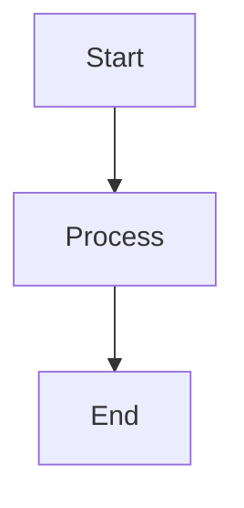

# Contributing to PDF Chat Bot

Thank you for your interest in contributing to the PDF Chat Bot project! This document provides guidelines and instructions for contributing to this multi-team collaborative project.

## 📋 Table of Contents

- [Getting Started](#getting-started)
- [Development Workflow](#development-workflow)
- [Code Standards](#code-standards)
- [Testing Requirements](#testing-requirements)
- [Documentation Requirements](#documentation-requirements)
- [Review Process](#review-process)
- [Release Process](#release-process)
- [Team Contacts](#team-contacts)

## 🚀 Getting Started

### Prerequisites

Before you begin, ensure you have the following installed:
- **Python 3.11+**
- **Git** (latest version)
- **VS Code** or preferred IDE
- **Docker** (for containerized development)

### Initial Setup

1. **Fork and Clone the Repository**
   ```bash
   git clone https://github.com/your-username/pdf-chat-langchain.git
   cd pdf-chat-langchain
   ```

2. **Set Up Development Environment**
   ```bash
   # Create virtual environment
   python -m venv .venv
   source .venv/bin/activate  # On Windows: .venv\Scripts\activate
   
   # Install dependencies
   pip install -r pdf-chat-bot/requirements.txt
   
   # Install development dependencies
   pip install -r requirements-dev.txt  # If exists
   ```

3. **Environment Configuration**
   ```bash
   # Copy environment template
   cp .env.example .env
   
   # Edit .env with your configuration
   # GOOGLE_API_KEY=your_gemini_api_key
   ```

4. **Verify Setup**
   ```bash
   # Run basic tests
   python -m pytest tests/ -v
   
   # Start application
   cd pdf-chat-bot
   streamlit run app.py
   ```

## 🔄 Development Workflow

### Branch Naming Convention

Use the following pattern for branch names:
- **Feature branches**: `feature/description-of-feature`
- **Bug fixes**: `bugfix/issue-number-description`
- **Documentation**: `docs/description-of-changes`
- **Hotfixes**: `hotfix/critical-issue-description`

### Git Workflow

1. **Create a New Branch**
   ```bash
   git checkout -b feature/your-feature-name
   ```

2. **Make Your Changes**
   - Follow code standards (see below)
   - Add tests for new functionality
   - Update documentation as needed

3. **Commit Your Changes**
   ```bash
   git add .
   git commit -m "feat: add new PDF processing feature"
   ```

4. **Push and Create Pull Request**
   ```bash
   git push origin feature/your-feature-name
   ```

### Commit Message Convention

We use [Conventional Commits](https://www.conventionalcommits.org/) format:

```
<type>[optional scope]: <description>

[optional body]

[optional footer(s)]
```

**Types:**
- `feat`: New feature
- `fix`: Bug fix
- `docs`: Documentation only changes
- `style`: Changes that don't affect code meaning (formatting, etc.)
- `refactor`: Code change that neither fixes a bug nor adds a feature
- `test`: Adding missing tests or correcting existing tests
- `chore`: Changes to build process or auxiliary tools

**Examples:**
```
feat(chat): add conversation history persistence
fix(pdf): resolve memory leak in large file processing
docs(api): update authentication examples
test(vector): add similarity search unit tests
```

## 💻 Code Standards

### Python Code Style

We follow **PEP 8** with some specific guidelines:

#### Formatting
- **Line Length**: 88 characters (Black formatter default)
- **Indentation**: 4 spaces (no tabs)
- **String Quotes**: Double quotes for strings, single quotes for string literals in code

#### Code Organization
```python
# Standard library imports
import os
import logging
from typing import List, Dict, Optional

# Third-party imports
import streamlit as st
from langchain import LangChain

# Local application imports
from src.pdf_processor import PDFProcessor
from src.utils import setup_logging
```

#### Naming Conventions
- **Variables and functions**: `snake_case`
- **Classes**: `PascalCase`
- **Constants**: `UPPER_SNAKE_CASE`
- **Private methods**: `_leading_underscore`

#### Type Hints
Always use type hints for function parameters and return values:
```python
def process_pdf(file_path: str, chunk_size: int = 1000) -> List[Dict[str, str]]:
    """Process PDF and return chunks with metadata."""
    pass
```

#### Documentation Strings
Use Google-style docstrings:
```python
def similarity_search(self, query: str, k: int = 5) -> Dict:
    """Search for similar documents using vector similarity.
    
    Args:
        query: The search query string
        k: Number of similar documents to return
        
    Returns:
        Dictionary containing documents, metadata, and distances
        
    Raises:
        ValueError: If query is empty or k is not positive
    """
```

### Code Quality Tools

We use the following tools for code quality:

#### Black (Code Formatting)
```bash
# Format code
black pdf-chat-bot/

# Check formatting
black --check pdf-chat-bot/
```

#### isort (Import Sorting)
```bash
# Sort imports
isort pdf-chat-bot/

# Check import sorting
isort --check-only pdf-chat-bot/
```

#### flake8 (Linting)
```bash
# Run linting
flake8 pdf-chat-bot/
```

#### mypy (Type Checking)
```bash
# Run type checking
mypy pdf-chat-bot/
```

### Pre-commit Hooks

Install pre-commit hooks to automatically run code quality checks:
```bash
# Install pre-commit
pip install pre-commit

# Install hooks
pre-commit install

# Run hooks manually
pre-commit run --all-files
```

## 🧪 Testing Requirements

### Test Structure

Tests are organized in the `tests/` directory:
```
tests/
├── unit/
│   ├── test_pdf_processor.py
│   ├── test_vector_store.py
│   └── test_chat_engine.py
├── integration/
│   ├── test_end_to_end.py
│   └── test_api_integration.py
├── test_docs/
│   ├── test_documentation.py
│   └── test_examples.py
└── fixtures/
    └── sample_data/
```

### Writing Tests

#### Unit Tests
```python
import pytest
from src.pdf_processor import PDFProcessor

class TestPDFProcessor:
    def setup_method(self):
        """Set up test fixtures before each test method."""
        self.processor = PDFProcessor()
    
    def test_extract_text_success(self):
        """Test successful PDF text extraction."""
        # Arrange
        pdf_path = "tests/fixtures/sample.pdf"
        
        # Act
        result = self.processor.extract_text_with_metadata(pdf_path)
        
        # Assert
        assert len(result) > 0
        assert "page_content" in result[0]
        assert "metadata" in result[0]
        assert result[0]["metadata"]["page"] == 1
```

#### Integration Tests
```python
def test_complete_pdf_processing_workflow():
    """Test the complete PDF processing workflow."""
    # Test PDF upload → processing → vector storage → query
    pass
```

### Test Coverage

Maintain **minimum 80% test coverage** for all new code:
```bash
# Run tests with coverage
pytest --cov=pdf-chat-bot tests/

# Generate HTML coverage report
pytest --cov=pdf-chat-bot --cov-report=html tests/
```

### Test Execution

```bash
# Run all tests
pytest

# Run specific test file
pytest tests/unit/test_pdf_processor.py

# Run tests with verbose output
pytest -v

# Run tests in parallel
pytest -n auto
```

## 📚 Documentation Requirements

### Code Documentation

#### Docstring Requirements
- All public functions and classes must have docstrings
- Use Google-style docstrings
- Include parameters, return values, and exceptions
- Provide usage examples for complex functions

#### Inline Comments
- Use comments sparingly for complex logic
- Explain **why**, not **what**
- Keep comments up-to-date with code changes

### Documentation Updates

When making changes, update relevant documentation:

#### Required Updates
- [ ] **API Documentation**: If changing APIs or interfaces
- [ ] **User Guide**: If affecting user workflows
- [ ] **Technical Documentation**: If changing architecture
- [ ] **README**: If changing setup or usage instructions

#### Documentation Testing
- [ ] All code examples in documentation must be tested
- [ ] Links must be validated
- [ ] Diagrams must be updated if logic changes

### Creating Documentation

#### Markdown Standards
- Use meaningful headings (H1, H2, H3)
- Include table of contents for long documents
- Use code blocks with language specification
- Add alt text for images and diagrams

#### Mermaid Diagrams
```markdown

```

## 🔍 Review Process

### Pull Request Guidelines

#### Before Creating a PR
- [ ] Code follows style guidelines
- [ ] Tests pass locally
- [ ] Documentation is updated
- [ ] Commit messages follow convention
- [ ] Branch is up-to-date with main

#### PR Description Template
Use the provided PR template and include:
- **Purpose**: What does this PR accomplish?
- **Changes**: What files/components were modified?
- **Testing**: How was this tested?
- **Screenshots**: For UI changes
- **Breaking Changes**: Any breaking changes?

#### Review Process
1. **Automated Checks**: CI/CD pipeline runs automatically
2. **Code Review**: At least 2 reviewers required
3. **Documentation Review**: Technical writer review for doc changes
4. **Testing**: QA team review for significant changes
5. **Approval**: Team lead approval required

### Review Checklist

#### For Reviewers
- [ ] **Code Quality**: Follows standards and best practices
- [ ] **Functionality**: Code does what it's supposed to do
- [ ] **Tests**: Adequate test coverage and quality
- [ ] **Documentation**: Updated and accurate
- [ ] **Security**: No security vulnerabilities
- [ ] **Performance**: No negative performance impact

#### Code Review Comments
- Be constructive and specific
- Explain reasoning behind suggestions
- Approve when ready, request changes when needed
- Use GitHub's suggestion feature for small fixes

## 🚀 Release Process

### Version Numbering

We use [Semantic Versioning](https://semver.org/):
- **MAJOR**: Breaking changes
- **MINOR**: New features (backward compatible)
- **PATCH**: Bug fixes (backward compatible)

### Release Workflow

1. **Feature Freeze**: No new features, only bug fixes
2. **Testing**: Comprehensive testing on staging environment
3. **Documentation**: Update all documentation
4. **Changelog**: Update CHANGELOG.md
5. **Tag Release**: Create git tag with version number
6. **Deploy**: Deploy to production environment

### Hotfix Process

For critical bugs in production:
1. Create hotfix branch from main
2. Implement fix with tests
3. Fast-track review process
4. Deploy immediately after approval

## 👥 Team Contacts

### Team Responsibilities

| Team | Responsibilities | Contact |
|------|------------------|---------|
| **Backend Team** | Core engine, APIs, data processing | @backend-team |
| **Frontend Team** | UI components, user experience | @frontend-team |
| **DevOps Team** | Infrastructure, CI/CD, deployment | @devops-team |
| **QA Team** | Testing, quality assurance | @qa-team |
| **Technical Writers** | Documentation, user guides | @tech-writers |
| **Product Team** | Requirements, user stories | @product-team |

### Code Owners

Refer to `.github/CODEOWNERS` for specific code ownership:
- **Core Engine**: @backend-team @tech-lead
- **UI Components**: @frontend-team @ux-team
- **Documentation**: @tech-writers @product-team
- **Infrastructure**: @devops-team @backend-team

### Getting Help

#### Communication Channels
- **General Questions**: Use GitHub Discussions
- **Bug Reports**: Create GitHub Issues
- **Feature Requests**: Create GitHub Issues with feature template
- **Urgent Issues**: Contact team leads directly

#### Office Hours
- **Technical Lead**: Mondays 2-4 PM
- **DevOps Team**: Tuesdays 10 AM-12 PM
- **QA Team**: Wednesdays 3-5 PM

## 📋 Checklist for Contributors

Before submitting your contribution:

### Development Checklist
- [ ] Code follows style guidelines
- [ ] All tests pass
- [ ] New tests added for new features
- [ ] Type hints added
- [ ] Docstrings added/updated
- [ ] No security vulnerabilities introduced

### Documentation Checklist
- [ ] README updated if needed
- [ ] API documentation updated
- [ ] User guide updated if needed
- [ ] Code examples tested
- [ ] Changelog updated

### Quality Checklist
- [ ] Pre-commit hooks pass
- [ ] No linting errors
- [ ] Type checking passes
- [ ] Test coverage maintained
- [ ] Performance not degraded

### Review Checklist
- [ ] PR template completed
- [ ] Reviewers assigned
- [ ] Labels applied
- [ ] Milestone set (if applicable)
- [ ] Breaking changes documented

## 🙏 Thank You

Thank you for contributing to the PDF Chat Bot project! Your contributions help make this tool better for everyone. If you have any questions or suggestions for improving this contribution guide, please don't hesitate to reach out.

## 📄 License

By contributing to this project, you agree that your contributions will be licensed under the same license as the project.

---

**Last Updated**: [Current Date]  
**Version**: 1.0  
**Maintainers**: Technical Lead Team  
**Review Schedule**: Monthly