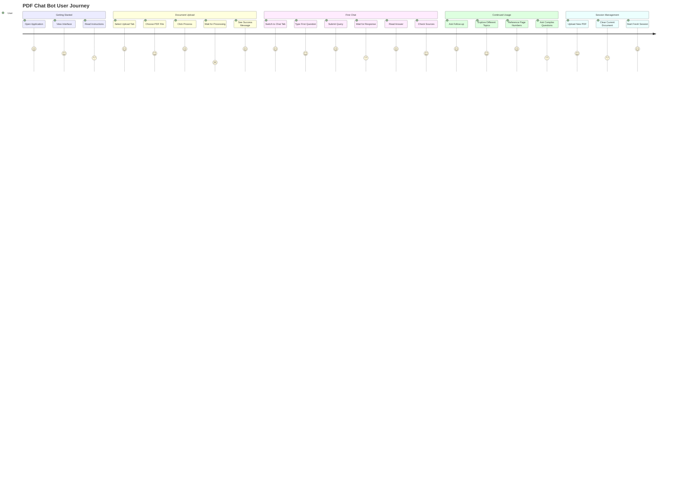

# PDF Chat Bot - Application Flow Diagrams

## Overview
This document contains comprehensive Mermaid diagrams illustrating the application flow, user interactions, and system behavior within the PDF Chat Bot.

## 1. Main Application Flow


## 2. User Interaction Flow



## 3. Streamlit Tab Navigation Flow


## 4. PDF Processing Workflow


## 5. Chat Interface Flow


## 6. Error Handling and User Feedback Flow


## 7. Session State Management Flow

```mermaid
flowchart TD
    subgraph "Session Initialization"
        A[App Start] --> B[Check Session State]
        B --> C{State Exists?}
        C -->|No| D[Initialize Default State]
        C -->|Yes| E[Load Existing State]
    end
    
    subgraph "State Variables"
        F[processed: Boolean]
        G[chat_history: List]
        H[processed_file: String]
        I[initialization_complete: Boolean]
    end
    
    subgraph "State Updates"
        J[PDF Upload] --> K[Set processed = False]
        K --> L[Clear chat_history]
        L --> M[Set processed_file = None]
        
        N[PDF Processing] --> O[Set processed = True]
        O --> P[Set processed_file = filename]
        
        Q[Chat Message] --> R[Append to chat_history]
        
        S[Clear PDF] --> T[Reset all states]
        T --> U[processed = False]
        U --> V[chat_history = []]
        V --> W[processed_file = None]
    end
    
    subgraph "State Persistence"
        X[UI Interactions] --> Y[Automatic State Save]
        Y --> Z[Session Storage]
        Z --> AA[State Available Next Interaction]
    end
    
    D --> F
    D --> G
    D --> H
    D --> I
    
    E --> F
    E --> G
    E --> H
    E --> I
    
    %% State flow connections
    J --> F
    N --> F
    Q --> G
    S --> F
    S --> G
    S --> H
    
    %% Persistence connections
    K --> X
    O --> X
    R --> X
    T --> X
    
    %% Styling
    classDef initClass fill:#e3f2fd
    classDef stateClass fill:#fff3e0
    classDef updateClass fill:#f3e5f5
    classDef persistClass fill:#e8f5e8
    
    class A,B,C,D,E initClass
    class F,G,H,I stateClass
    class J,K,L,M,N,O,P,Q,R,S,T,U,V,W updateClass
    class X,Y,Z,AA persistClass
```

## 8. Auto-Processing Logic Flow

```mermaid
flowchart TD
    A[App Initialization] --> B[Check initialization_complete]
    B --> C{First Load?}
    C -->|Yes| D[Start Auto-Process Logic]
    C -->|No| E[Skip Auto-Process]
    
    D --> F[Check Vector Store]
    F --> G{Existing Data?}
    G -->|Yes| H[Set processed = True]
    G -->|No| I[Check File System]
    
    H --> J[Load Existing State]
    J --> K[Display "Data Found" Message]
    
    I --> L[Scan data/uploads Directory]
    L --> M{PDF Files Found?}
    M -->|No| N[No Auto-Process]
    M -->|Yes| O[Select First PDF]
    
    O --> P[Check File Size]
    P --> Q{Size Acceptable?}
    Q -->|No| R[Skip Large File]
    Q -->|Yes| S[Start Processing]
    
    S --> T[Show Progress to User]
    T --> U[Process with Progress Updates]
    U --> V{Processing Success?}
    V -->|Yes| W[Set processed = True]
    V -->|No| X[Show Error Message]
    
    W --> Y[Update Session State]
    Y --> Z[Display Success Message]
    
    X --> AA[Log Error Details]
    AA --> AB[Reset State]
    
    R --> AC[Log Skip Reason]
    N --> AC
    AB --> AC
    
    K --> AD[Set initialization_complete = True]
    Z --> AD
    AC --> AD
    E --> AD
    
    AD --> AE[Continue to UI]
    
    %% Decision annotations
    G -.->|"Check document count > 0"| H
    M -.->|"glob('*.pdf')"| O
    Q -.->|"< 50MB recommended"| S
    
    %% Styling
    classDef startClass fill:#c8e6c9
    classDef checkClass fill:#fff3e0
    classDef processClass fill:#bbdefb
    classDef successClass fill:#e8f5e8
    classDef errorClass fill:#ffcdd2
    classDef endClass fill:#f3e5f5
    
    class A,D startClass
    class B,C,F,G,I,L,M,P,Q,V checkClass
    class S,T,U processClass
    class H,J,K,W,Y,Z successClass
    class R,X,AA,AB,AC errorClass
    class E,N,AD,AE endClass
```

## 9. Component Lifecycle Flow


## 10. Performance Monitoring Flow


## 11. Complete User Workflow


---

## Usage Instructions

### Rendering Diagrams
These Mermaid diagrams are best viewed in:
- GitHub repositories (native support)
- Mermaid Live Editor
- Documentation platforms with Mermaid support
- IDE extensions (VS Code, etc.)

### Diagram Categories
1. **Application Flow**: Overall system behavior
2. **User Interaction**: User journey and experience
3. **State Management**: Session and component states
4. **Error Handling**: Error flows and recovery
5. **Performance**: Monitoring and optimization

### Maintenance
Update these diagrams when:
- UI changes are implemented
- New features are added
- User workflows are modified
- Error handling is enhanced

---

*These application flow diagrams provide a comprehensive view of user interactions and system behavior within the PDF Chat Bot. They serve as both user experience documentation and development reference.*