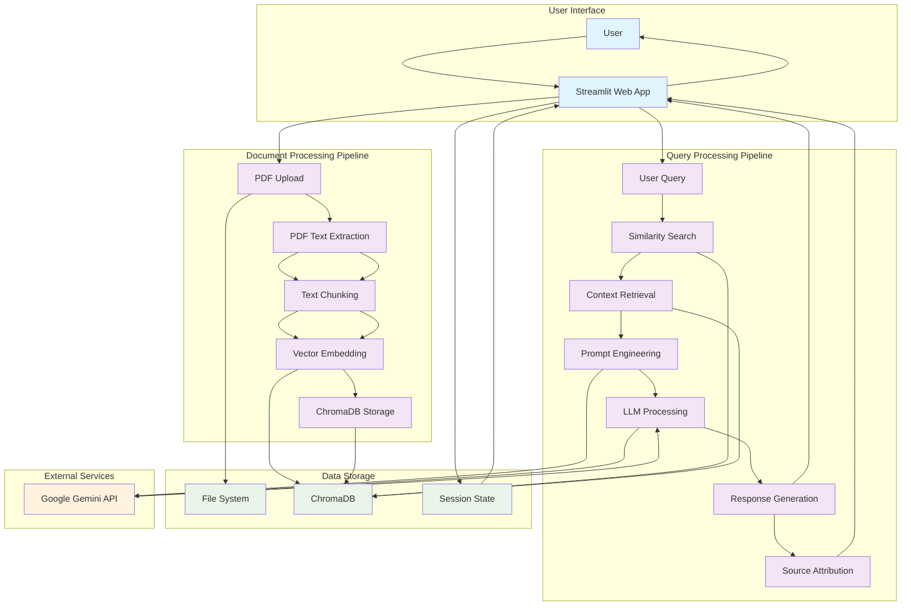
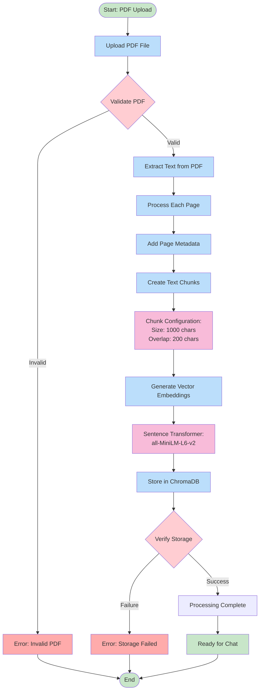
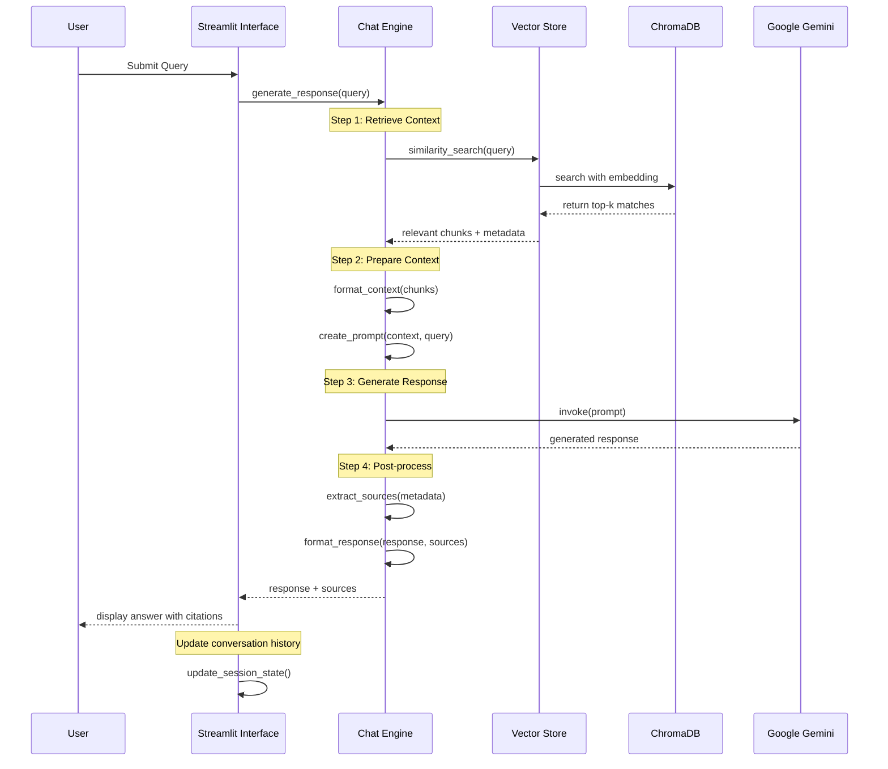
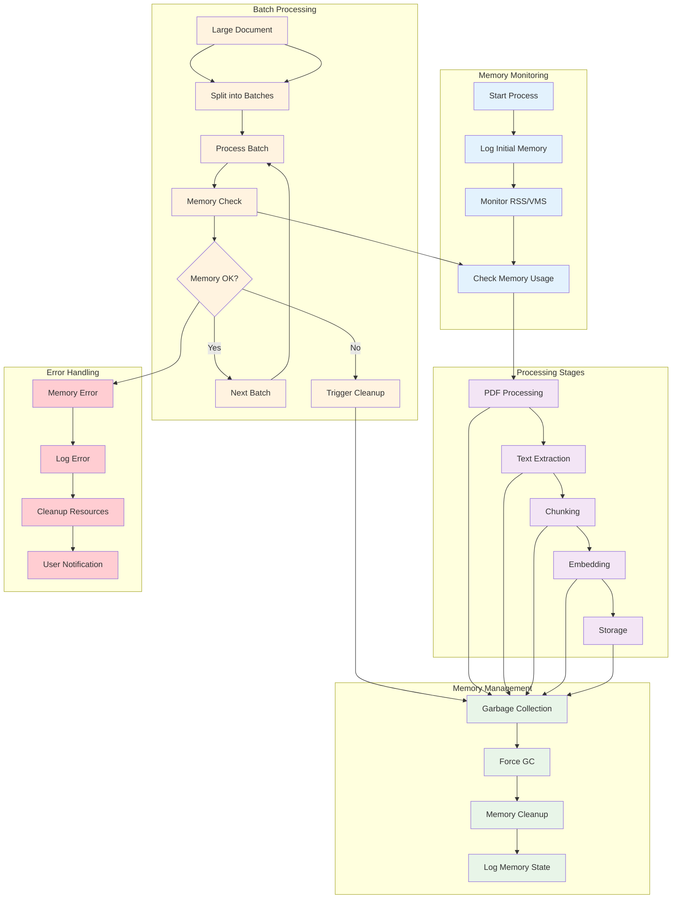
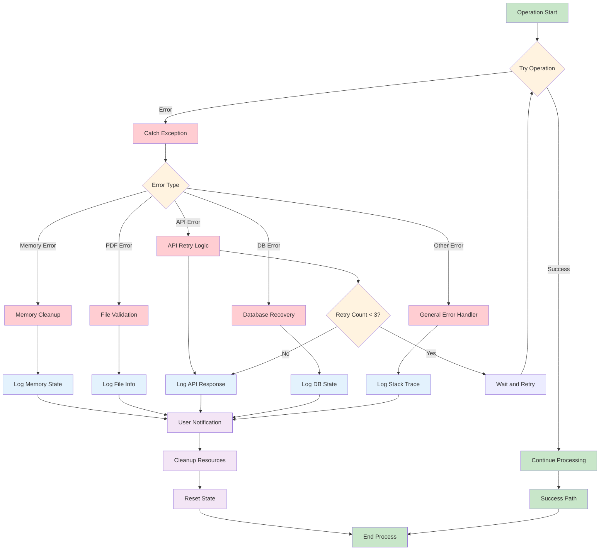
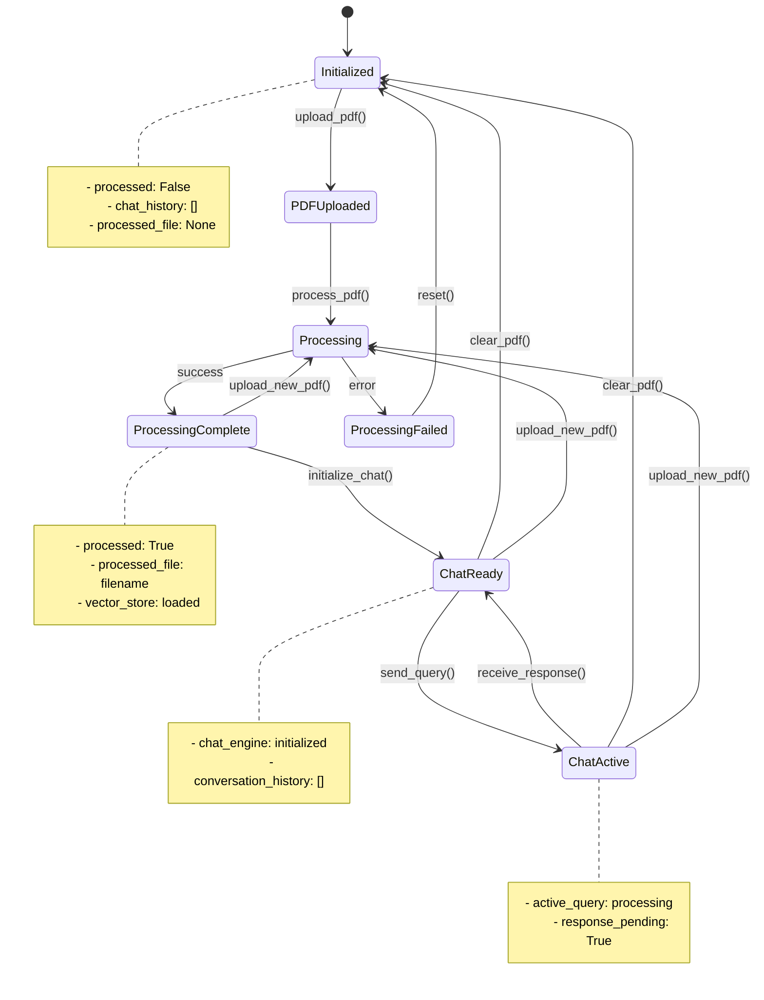
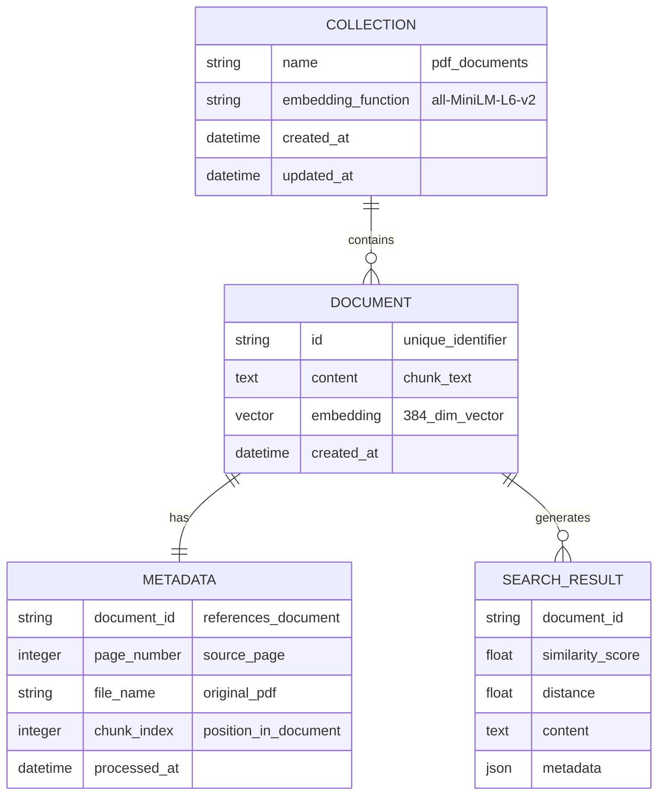
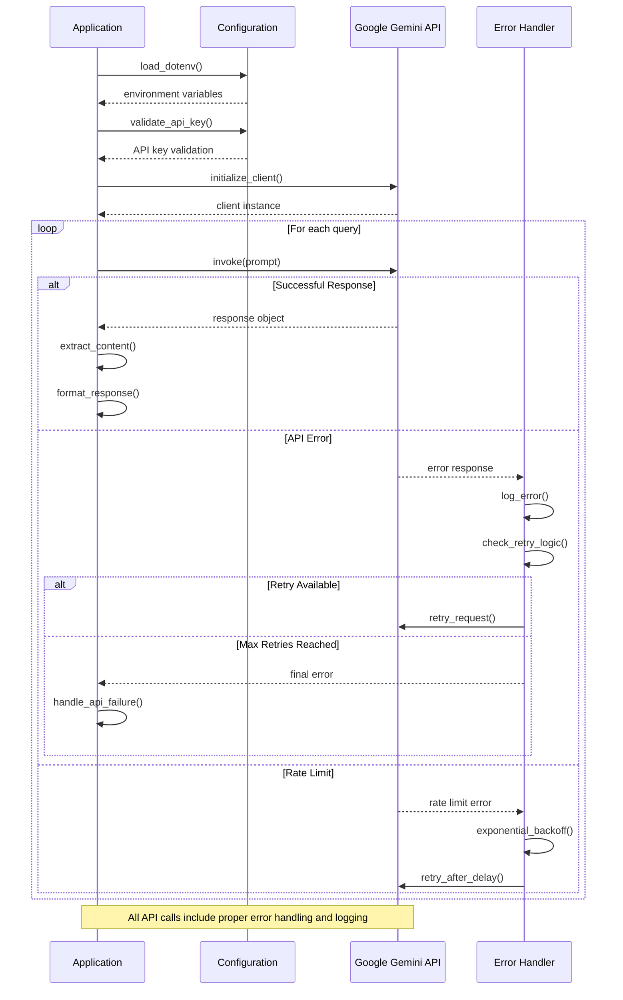

# PDF Chat Bot - Data Flow Diagrams

## Overview
This document contains detailed Mermaid diagrams illustrating the data flow and processing pipelines within the PDF Chat Bot system.

## 1. Complete System Data Flow



## 2. Document Processing Flow



## 3. Vector Embedding Process

```mermaid
graph LR
    subgraph "Text Processing"
        A[Raw PDF Text] --> B[Text Cleaning]
        B --> C[Sentence Segmentation]
        C --> D[Text Chunks]
    end
    
    subgraph "Embedding Generation"
        D --> E[Sentence Transformer Model]
        E --> F[384-dim Vectors]
        F --> G[Vector Normalization]
    end
    
    subgraph "Storage Preparation"
        G --> H[Metadata Attachment]
        H --> I[Batch Formation]
        I --> J[ChromaDB Format]
    end
    
    subgraph "Database Operations"
        J --> K[ChromaDB Insert]
        K --> L[Index Creation]
        L --> M[Persistence]
    end
    
    %% Data flow annotations
    B -.->|"Remove special chars,<br/>normalize whitespace"| C
    D -.->|"1000 chars with<br/>200 char overlap"| E
    E -.->|"all-MiniLM-L6-v2<br/>model"| F
    H -.->|"Page numbers,<br/>document ID"| I
    I -.->|"Batch size: 25"| J
    
    %% Styling
    classDef textClass fill:#e3f2fd
    classDef embeddingClass fill:#f3e5f5
    classDef storageClass fill:#e8f5e8
    classDef dbClass fill:#fff3e0
    
    class A,B,C,D textClass
    class E,F,G embeddingClass
    class H,I,J storageClass
    class K,L,M dbClass
```



## 4. Query Processing and RAG Pipeline



## 5. Similarity Search Process

```mermaid
graph TD
    A[User Query] --> B[Query Preprocessing]
    B --> C[Generate Query Embedding]
    C --> D[Vector Similarity Search]
    
    D --> E[ChromaDB Search]
    E --> F[Calculate Cosine Similarity]
    F --> G[Rank Results]
    G --> H[Filter by Threshold]
    
    H --> I[Extract Top-K Results]
    I --> J[Retrieve Document Text]
    J --> K[Retrieve Metadata]
    
    K --> L[Format Results]
    L --> M[Return to Chat Engine]
    
    subgraph "Search Parameters"
        N[k=5 documents]
        O[similarity threshold]
        P[distance metric: cosine]
    end
    
    subgraph "Result Format"
        Q[documents: List[str]]
        R[metadatas: List[Dict]]
        S[distances: List[float]]
    end
    
    %% Connections to parameters
    E --> N
    F --> O
    F --> P
    
    %% Connections to result format
    L --> Q
    L --> R
    L --> S
    
    %% Styling
    classDef queryClass fill:#e1f5fe
    classDef searchClass fill:#f3e5f5
    classDef resultClass fill:#e8f5e8
    classDef paramClass fill:#fff3e0
    
    class A,B,C queryClass
    class D,E,F,G,H,I searchClass
    class J,K,L,M resultClass
    class N,O,P,Q,R,S paramClass
```

## 6. Memory Management Flow



## 7. Error Handling and Recovery Flow



## 8. Session State Management



## 9. ChromaDB Data Structure



## 10. API Integration Flow



---

## Usage Notes

### Viewing Diagrams
These Mermaid diagrams can be viewed in:
- GitHub (native support)
- Mermaid Live Editor (https://mermaid.live)
- VS Code with Mermaid extension
- Any Markdown viewer with Mermaid support

### Customization
The diagrams can be customized by modifying:
- Colors and styling using CSS classes
- Node shapes and connections
- Layout direction and spacing
- Content and labels

### Updates
These diagrams should be updated when:
- System architecture changes
- New components are added
- Data flow is modified
- Error handling is updated

---

*These diagrams provide a comprehensive view of the data flow within the PDF Chat Bot system. They serve as both documentation and design reference for development and maintenance.*