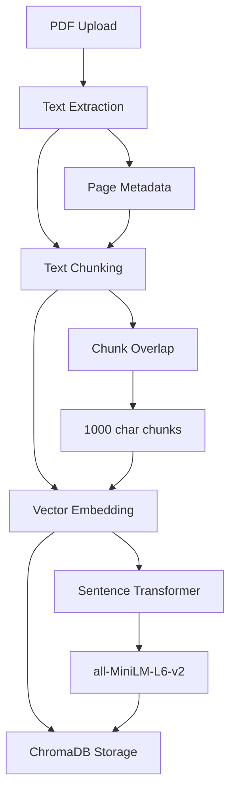
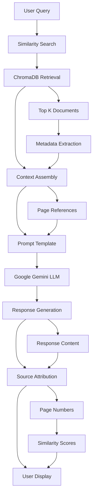
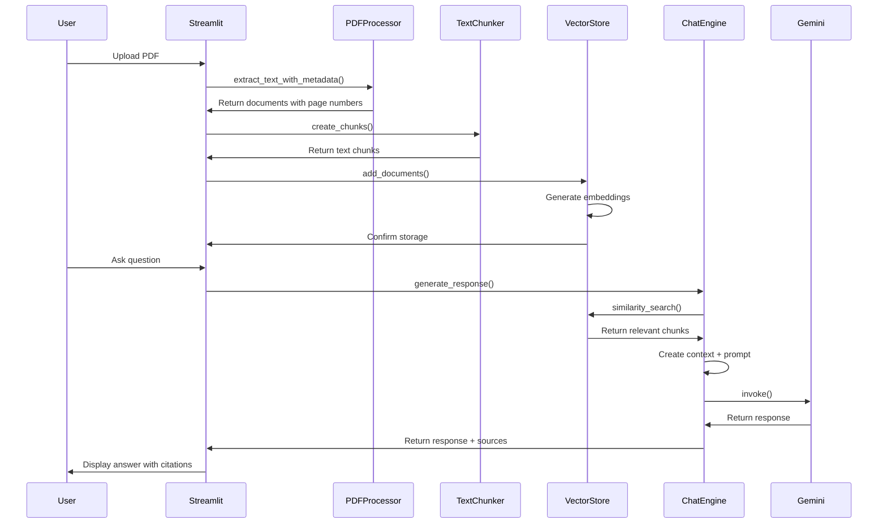

# PDF Chat Bot - Technical Documentation

## Architecture Overview

The PDF Chat Bot is a Retrieval-Augmented Generation (RAG) system built with a modular architecture using Python, LangChain, ChromaDB, and Google Gemini. The system processes PDF documents, creates vector embeddings, and enables intelligent question-answering with source attribution.

## Technology Stack

### Core Technologies
- **Python 3.11**: Primary programming language
- **Streamlit**: Web application framework
- **LangChain**: Framework for building LLM applications
- **ChromaDB**: Vector database for embeddings storage
- **Google Gemini (gemini-1.5-flash)**: Large Language Model for text generation
- **Sentence Transformers**: For creating text embeddings

### Supporting Libraries
- **PyPDF**: PDF text extraction
- **python-dotenv**: Environment variable management
- **psutil**: System monitoring and memory management
- **logging**: Comprehensive application logging

## System Architecture

### High-Level Components

```
┌─────────────────┐    ┌─────────────────┐    ┌─────────────────┐
│   Streamlit     │    │   LangChain     │    │   ChromaDB      │
│   Frontend      │◄──►│   Processing    │◄──►│   Vector Store  │
└─────────────────┘    └─────────────────┘    └─────────────────┘
         │                       │                       │
         │                       │                       │
         ▼                       ▼                       ▼
┌─────────────────┐    ┌─────────────────┐    ┌─────────────────┐
│   PDF Upload    │    │   Text Chunking │    │   Similarity    │
│   Processing    │    │   & Embedding   │    │   Search        │
└─────────────────┘    └─────────────────┘    └─────────────────┘
         │                       │                       │
         │                       │                       │
         ▼                       ▼                       ▼
┌─────────────────┐    ┌─────────────────┐    ┌─────────────────┐
│   Text          │    │   Vector        │    │   Google Gemini │
│   Extraction    │    │   Embeddings    │    │   LLM           │
└─────────────────┘    └─────────────────┘    └─────────────────┘
```

## Core Components

### 1. PDF Processor (`src/pdf_processor.py`)

#### PDFProcessor Class
- **Purpose**: Extracts text from PDF files with metadata preservation
- **Key Methods**:
  - `extract_text_with_metadata(pdf_path)`: Extracts text from each page with page numbers

#### TextChunker Class
- **Purpose**: Splits large text into manageable chunks for processing
- **Configuration**:
  - `chunk_size`: 1000 characters (configurable)
  - `chunk_overlap`: 200 characters (configurable)
  - `length_function`: Character-based counting (compatible with all LLMs)

**Technical Details**:
```python
# Character-based chunking for LLM compatibility
text_splitter = RecursiveCharacterTextSplitter(
    chunk_size=self.chunk_size,
    chunk_overlap=self.chunk_overlap,
    length_function=len,  # Using len() instead of tokenizer
)
```

### 2. Vector Store (`src/vector_store.py`)

#### VectorStore Class
- **Purpose**: Manages ChromaDB operations for document storage and retrieval
- **Key Methods**:
  - `add_documents(chunks)`: Adds document chunks to vector database
  - `similarity_search(query)`: Finds most relevant documents for a query
  - `has_documents()`: Checks if database contains documents
  - `get_document_count()`: Returns number of stored documents

**Technical Implementation**:
```python
# ChromaDB configuration
self.client = chromadb.PersistentClient(path="./chroma_db")
self.collection = self.client.get_or_create_collection(
    name="pdf_documents",
    embedding_function=embedding_functions.SentenceTransformerEmbeddingFunction(
        model_name="all-MiniLM-L6-v2"
    )
)
```

### 3. Chat Engine (`src/chat_engine.py`)

#### ChatEngine Class
- **Purpose**: Handles RAG pipeline for question-answering
- **Key Components**:
  - Google Gemini LLM integration
  - Prompt template management
  - Source attribution
  - Conversation history tracking

**RAG Pipeline Implementation**:
```python
# Retrieve relevant context
search_results = self.vector_store.similarity_search(query)

# Create context from retrieved documents
context = "\n\n".join([
    f"[Source: Page {metadata.get('page', 'Unknown')}]\n{doc}" 
    for doc, metadata in zip(documents, metadatas)
])

# Generate response using Gemini
response = self.llm.invoke(self.prompt_template.format(
    context=context, 
    question=query
))
```

### 4. Streamlit Application (`app.py`)

#### Application Flow
1. **Initialization**: Setup logging, session state, and components
2. **Auto-processing**: Automatically process existing PDFs
3. **Two-tab Interface**:
   - Upload & Process: PDF upload and processing
   - Chat: Question-answering interface

#### Key Features
- **Memory Management**: Extensive memory monitoring with `psutil`
- **Error Handling**: Comprehensive exception handling and logging
- **Progress Tracking**: Real-time progress updates for long operations
- **Session State**: Maintains application state across interactions

## Data Flow Architecture

### Document Processing Pipeline



### Query Processing Pipeline



## Application Flow

### Complete System Flow



## Configuration and Environment

### Environment Variables
```bash
# Required
GOOGLE_API_KEY=your_gemini_api_key

# Optional
STREAMLIT_SERVER_PORT=8501
STREAMLIT_SERVER_ADDRESS=localhost
```

### File Structure
```
pdf-chat-langchain/
├── pdf-chat-bot/
│   ├── src/
│   │   ├── __init__.py
│   │   ├── pdf_processor.py      # PDF processing and chunking
│   │   ├── vector_store.py       # ChromaDB operations
│   │   ├── chat_engine.py        # RAG pipeline and LLM
│   │   └── utils.py              # Logging and utilities
│   ├── data/uploads/             # PDF storage
│   ├── logs/                     # Application logs
│   ├── app.py                    # Main Streamlit application
│   └── requirements.txt          # Dependencies
├── chroma_db/                    # ChromaDB persistence
├── docs/                         # Documentation
└── .env                          # Environment variables
```

## Database Schema

### ChromaDB Collection Structure
```python
# Collection: "pdf_documents"
{
    "ids": ["0", "1", "2", ...],           # Unique document IDs
    "documents": ["chunk text", ...],       # Text content
    "metadatas": [{"page": 1}, ...],       # Page numbers
    "embeddings": [[0.1, 0.2, ...], ...]  # Vector embeddings
}
```

### Embedding Model
- **Model**: `all-MiniLM-L6-v2`
- **Dimensions**: 384
- **Type**: Sentence Transformer
- **Language**: English (optimized)

## Performance Considerations

### Memory Management
- **Batch Processing**: Documents processed in configurable batches
- **Garbage Collection**: Explicit memory cleanup after operations
- **Memory Monitoring**: Real-time memory usage tracking
- **Session State**: Efficient state management

### Optimization Strategies
```python
# Batch processing for large documents
batch_size = 25
for i in range(0, len(chunks), batch_size):
    batch = chunks[i:i + batch_size]
    vector_store.add_documents(batch)
    
# Memory cleanup
gc.collect()
log_memory_usage("after_batch")
```

### Scalability Limits
- **Single Document**: One PDF per session
- **File Size**: Recommended < 50MB
- **Concurrent Users**: Limited by memory constraints
- **Vector Storage**: Persistent across sessions

## Error Handling and Logging

### Logging Configuration
```python
logging.basicConfig(
    level=logging.DEBUG,
    format='%(asctime)s - %(name)s - %(levelname)s - %(funcName)s:%(lineno)d - %(message)s',
    handlers=[
        logging.FileHandler('logs/debug.log'),
        logging.StreamHandler()
    ]
)
```

### Error Categories
1. **Memory Errors**: Large file handling
2. **Processing Errors**: PDF extraction failures
3. **API Errors**: Google Gemini service issues
4. **Vector Store Errors**: ChromaDB operations
5. **Application Errors**: Streamlit runtime issues

## Security Considerations

### Data Privacy
- **Local Processing**: Documents processed locally
- **No Persistence**: Session-based document handling
- **API Security**: Secure API key management
- **File Cleanup**: Temporary files removed after processing

### API Security
```python
# Environment variable usage
load_dotenv()
api_key = os.getenv("GOOGLE_API_KEY")
```

## Testing and Validation

### Unit Testing Strategy
- **PDF Processing**: Text extraction validation
- **Chunking**: Overlap and size verification
- **Vector Operations**: Embedding and retrieval testing
- **LLM Integration**: Response quality assessment

### Integration Testing
- **End-to-End Flow**: Complete document processing
- **Memory Stress Testing**: Large document handling
- **Error Scenario Testing**: Failure mode validation

## Deployment Considerations

### Local Development
```bash
# Setup
python -m venv .venv
source .venv/bin/activate  # Unix
pip install -r pdf-chat-bot/requirements.txt

# Run
cd pdf-chat-bot
streamlit run app.py
```

### Production Deployment
- **Docker**: Containerized deployment
- **Resource Requirements**: 4GB+ RAM recommended
- **API Limits**: Google Gemini rate limiting
- **Storage**: ChromaDB persistence volume

### Monitoring
- **Application Logs**: Comprehensive logging
- **Memory Usage**: Real-time monitoring
- **API Usage**: Request tracking
- **Performance Metrics**: Response time monitoring

## Future Enhancements

### Planned Features
1. **Multi-document Support**: Process multiple PDFs simultaneously
2. **Document Comparison**: Compare content across documents
3. **Advanced Analytics**: Usage statistics and performance metrics
4. **API Endpoints**: RESTful API for programmatic access

### Technical Improvements
1. **Async Processing**: Non-blocking document processing
2. **Caching**: Response caching for repeated queries
3. **Load Balancing**: Multi-instance support
4. **Database Optimization**: Advanced ChromaDB configurations

### Scalability Roadmap
1. **Microservices**: Component separation
2. **Message Queues**: Asynchronous processing
3. **Distributed Storage**: Scalable vector database
4. **Cloud Integration**: Cloud-native deployment

## API Reference

### Core Classes

#### PDFProcessor
```python
class PDFProcessor:
    def __init__(self):
        """Initialize PDF processor with logging"""
        
    def extract_text_with_metadata(self, pdf_path: str) -> List[Dict]:
        """Extract text from PDF with page metadata"""
```

#### TextChunker
```python
class TextChunker:
    def __init__(self, chunk_size=1000, chunk_overlap=200):
        """Initialize text chunker with configuration"""
        
    def create_chunks(self, documents: List[Dict]) -> List[Dict]:
        """Create overlapping text chunks"""
```

#### VectorStore
```python
class VectorStore:
    def __init__(self, collection_name="pdf_documents"):
        """Initialize ChromaDB vector store"""
        
    def add_documents(self, chunks: List[Dict], batch_size: int = 100):
        """Add document chunks to vector database"""
        
    def similarity_search(self, query: str, k: int = 5) -> Dict:
        """Search for similar documents"""
```

#### ChatEngine
```python
class ChatEngine:
    def __init__(self, vector_store: VectorStore):
        """Initialize chat engine with vector store"""
        
    def generate_response(self, query: str) -> Dict:
        """Generate response using RAG pipeline"""
```

## Troubleshooting Guide

### Common Issues

#### Memory Errors
```python
# Solution: Reduce batch size
batch_size = 10  # Reduce from default 25
```

#### ChromaDB Issues
```python
# Solution: Reset database
import shutil
shutil.rmtree("./chroma_db")
```

#### API Errors
```python
# Solution: Check API key and limits
if not os.getenv("GOOGLE_API_KEY"):
    raise ValueError("GOOGLE_API_KEY not found")
```

### Performance Issues
- **Slow Processing**: Reduce chunk size or batch size
- **Memory Leaks**: Ensure proper garbage collection
- **API Timeouts**: Implement retry logic

### Debugging Tools
- **Memory Profiling**: `psutil` integration
- **Logging**: Comprehensive debug logs
- **Performance Metrics**: Request timing
- **Error Tracking**: Exception handling

---

*This technical documentation provides comprehensive implementation details for developers working with the PDF Chat Bot codebase. For user-facing documentation, refer to the User Guide.*